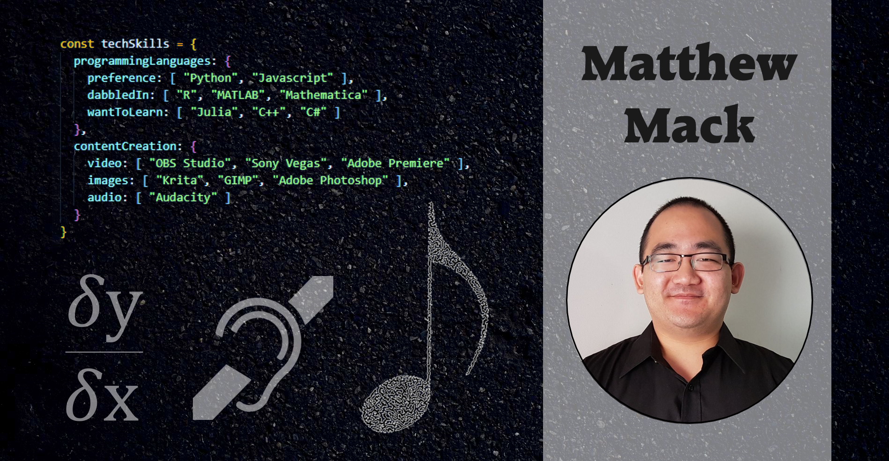

## I'm looking for work!

So admittedly I'm a bit of a mixed bag of skills (which should hopefully speak to my versatility!), but roles I'm looking out are (in):

* **mathematical consulting** - my specialty is in operations research, but am open to data analysis/science roles!
* **learning design** - I've been teaching university-level mathematics for 5+ years and have been involved in producing learning resources!
* **junior software engineer / full-stack developer** - I'm completely self-taught and slowly catching up on my CS knowledge, but have had a lot of fun with programming and building things for fun. Hopefully my pinned repos give you a taste of what I'm capable of!

On top of all that, I'm capable of doing some content creation: some basic photoshopping, making & editing Youtube videos (both gaming and educational), and if you want me to help you produce a podcast along the way, I'm game!

## You can find me at...

* <a href="https://twitter.com/matthras">Twitter</a> 
* <a href="https://www.linkedin.com/in/matthewypmack/">LinkedIn</a>
* <a href="https://matthras.com">My personal blog</a>

<!--
**matthras/matthras** is a ✨ _special_ ✨ repository because its `README.md` (this file) appears on your GitHub profile.

Here are some ideas to get you started:

- 🔭 I’m currently working on ...
- 🌱 I’m currently learning ...
- 👯 I’m looking to collaborate on ...
- 🤔 I’m looking for help with ...
- 💬 Ask me about ...
- 📫 How to reach me: ...
- 😄 Pronouns: ...
- ⚡ Fun fact: ...
-->
